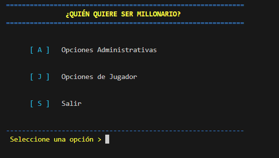

# Quien Quiere Ser Millonario ConsolApp

[](https://github.com/Geovanni-Gonzalez/QuienQuiereSerMillonario-ConsolApp/actions/workflows/ci.yml)

## Descripción
Juego de trivia estilo concurso en Python para consola con preguntas, acceso administrativo, historial e indice de partidas.

## Objetivo
Practicar menus, gestión de preguntas, reglas de juego y persistencia local.

## Tecnologías utilizadas
- Python 3
- Consola
- Archivos .txt
- Programación modular

## Funcionalidades principales
- Juego de preguntas
- Banco de preguntas
- Historial e indice
- Admin/auth
- UI de consola

## Mi rol
Implementé flujo de juego, datos, autenticación e interfaz textual.

## Aprendizajes clave
- Juegos por rondas
- Persistencia
- Validación
- Módulos Python

## Instalación y ejecución
```bash
cd QuienQuiereSerMillonario-ConsolApp/programa
python main.py
```

## Estructura del proyecto
- programa/main.py: entrada
- programa/modules/: módulos
- Preguntas.txt: banco
- Historial/Indice: registro

## Capturas o demo


## Estado del proyecto
Proyecto académico funcional.

## Valor técnico demostrado
Muestra flujos interactivos, persistencia y separación de responsabilidades.

## Mejoras futuras
- Validar formato preguntas
- Agregar pruebas
- Documentar admin

## Autor
Geovanni González  
Estudiante de Ingeniería en Computación  
GitHub: [Geovanni-Gonzalez](https://github.com/Geovanni-Gonzalez)


